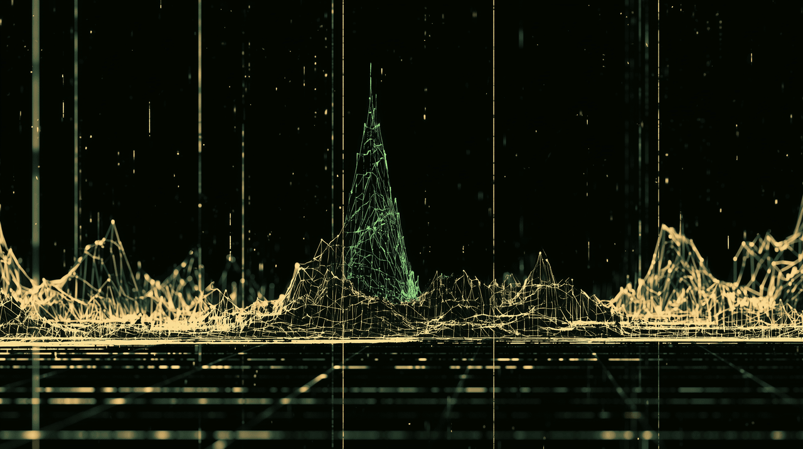

# assay

> Assay the weights before you trust them.



`assay` is an offline-first, single-binary scanner for ML model artifacts
(`safetensors`, `GGUF`, PyTorch pickle). It answers two questions about a model
you just downloaded:

1. **Is this file what it claims to be?** — provenance & integrity
2. **Does loading it put my machine at risk?** — format-level safety

A downloaded model is a multi-gigabyte opaque blob that people execute with
total trust. We would never do that with a random `.exe`. `assay` applies the
same supply-chain hygiene to model weights.

> The name comes from metallurgy: an *assay* tests the purity and composition of
> a metal. A model is literally *weights* — so `assay` tests whether those
> weights are pure (no contaminant) and authentic (real provenance).

📖 **New to `assay`?** [`DUMMIE.md`](./DUMMIE.md) is a complete, illustrated
walkthrough — ASCII diagrams of every check, both phases, `--deep` / `--profile`,
and `compare`, with real example output.

---

## Status — Phase 2 shipped

**Phase 1 — provenance & integrity** (default, always on). Boring, solid,
high-confidence, deterministic **verdicts**:

- Format detection & structural parsing (`safetensors` / `GGUF` / pickle)
- Pickle / arbitrary-code-execution risk flagging
- `safetensors` header & offset validation
- `GGUF` metadata sanity + embedded-template flagging
- Deterministic content hashing (per-tensor + manifest)
- Signature verification (detached ed25519 + model-transparency manifest;
  full Sigstore/cosign chain reported as unverified, not trusted)
- Human + JSON reports, CI-friendly exit codes

**Phase 2 — weight inspection** (opt-in via `--deep`). Inspects the weights
themselves. There is no external ground truth here, so Phase 2 emits **signals
with scores and severities, never verdicts** — a high score means "anomalous,
worth a human look", never "malicious". It never loads or executes the model;
tensors are read cold and streamed (mmap, online moments) so peak RAM stays well
under model size.

- **2a** per-tensor stats — NaN/Inf integrity, mean/std, L2/RMS, excess
  kurtosis, sparsity, 6σ outlier mass (`WEIGHT_NAN_INF`)
- **2b** layer profile — robust median/MAD anomaly detection across layers,
  terminal sparkline + optional 1D SVG (`WEIGHT_OUTLIER_LAYER`)
- **2c** secret/string scanning over metadata & sibling configs
  (`EMBEDDED_SECRET`, `SUSPICIOUS_URL`; experimental tensor-entropy behind a flag)
- **2d** architectural fingerprint (`ARCH_DETECTED`, `ARCH_MISMATCH`)

**`compare SUBJECT BASELINE` — differential weight analysis.** Weight analysis
is most honest as a *diff against a known-good reference*, not a judgment of a
model in isolation: a normally-trained transformer is naturally non-uniform
across layers, so the standalone profile can flag legitimate peaks. `compare`
makes the baseline the zero line — identical models are silent, a uniform
fine-tune shows broad even drift (quiet), and a localized tamper shows a single
concentrated spike (flagged). It streams matched tensor pairs in lockstep (mmap
both, never both full models in RAM), guards against cross-architecture
comparison (`ARCH_MISMATCH`, override with `--force`), and emits
`STRUCTURAL_DIVERGENCE` (near-verdict-grade) for added/removed/reshaped tensors,
`LAYER_DRIFT_OUTLIER` / `TENSOR_DRIFT` for concentrated drift (robust MAD), and
`IDENTICAL` when drift is ~0 everywhere. Same mindset: signals, not verdicts.

GGUF note: legacy quants (Q4_0/Q4_1/Q5_0/Q5_1/Q8_0) and F32/F16/BF16 are
dequantized for real stats; k-quant / IQ tensors are reported
`STATS_DEFERRED_QUANTIZED` (structural info only) rather than computing garbage
on raw block bytes.

**Roadmap / out of scope (do not expect these yet):**

- Full k-quant dequantization (prerequisite for Phase 3; legacy quants done)
- **Phase 3** — GGUF quantization-error differential (the killer feature:
  detecting payloads that only activate after quantization). Research-grade,
  deliberately not promised yet. It is conceptually the *same idea as `compare`*:
  diff against a reference — except the reference is the full-precision model
  rather than a sibling, and the signal is the per-weight quantization error.
  Phase 2's dequant + streaming machinery and `compare`'s lockstep drift engine
  are the groundwork.
- Gradient/forward-pass model fingerprinting — **permanently out of scope**: it
  would require executing the model, breaking the "never load" invariant.

---

## Install

```sh
# from crates.io
cargo install assay

# or prebuilt static binaries
# see GitHub releases — no runtime deps, single file
```

---

## Usage

```sh
# scan a single file
assay scan model.safetensors

# scan a whole model directory (HF-style repo)
assay scan ./Qwen2.5-0.5B-Instruct/

# CI mode: machine-readable, non-zero exit on findings
assay scan ./model/ --json --fail-on high

# verify a signature / provenance bundle alongside the weights
assay verify ./model/ --bundle model.sig

# Phase 2: inspect the weights (signals, not verdicts)
assay scan ./model/ --deep --profile          # per-tensor stats + layer sparkline
assay scan ./model/ --deep --svg profile.svg  # write the 1D layer-profile chart
assay scan ./model/ --deep --mad-k 5.0 --json # tune the robust anomaly threshold

# compare: how a model differs from a known-good baseline (the honest profile)
assay compare ./model-suspect/ ./model-known-good/      # drift profile + spikes
assay compare ./subject/ ./baseline/ --svg drift.svg --json
assay compare ./a/ ./b/ --force                         # across architectures (unreliable)
```

Phase 2 flags: `--deep` (alias `--stats`) enables weight analysis; `--profile`
prints the per-layer sparkline; `--svg <path>` writes a faithful 1D chart;
`--mad-k <f64>` sets the anomaly threshold in MADs (default 5.0). Real-time scan
progress prints to stderr (auto-disabled off a TTY or with `--no-progress`);
`--color auto|always|never` controls colorization.

### Exit codes

| Code | Meaning                                             |
|------|-----------------------------------------------------|
| `0`  | clean — no findings at or above the threshold       |
| `1`  | findings at/above `--fail-on` severity              |
| `2`  | unreadable / malformed artifact (parse failure)     |
| `>2` | internal error                                      |

---

## Example output

### `scan --deep --profile` on real gpt2 (Phase 1 + Phase 2)

```text
$ assay scan ./models/gpt2 --deep --profile
[1/2] ./models/gpt2/model.safetensors CLEAN 3 finding(s) (22.90s)
[2/2] ./models/gpt2/pytorch_model.bin UNTRUSTED 3 finding(s) (1ms)
✓ scanned 2 artifact(s) — 1 clean, 1 untrusted, 1.0 GiB in 22.91s

./models/gpt2/model.safetensors  [safetensors]  -> CLEAN
  manifest: blake3:d4ceed607f7040ba84b91eadef010d98079f9d9d85ffd6faf13d77ce958eccdf
  signature: unsigned
  [low]  WEIGHT_OUTLIER_LAYER: layer 3 is anomalous on mean_kurtosis (6.0 MADs from the cross-layer median) — worth a human look, not a verdict
      - metric=mean_kurtosis, value=119.9821, mads=6.00
  [low]  WEIGHT_OUTLIER_LAYER: layer 11 is anomalous on l2 (7.3 MADs from the cross-layer median) — worth a human look, not a verdict
      - metric=l2, value=840.6817, mads=7.27
  [info] ARCH_DETECTED: structural fingerprint: gpt2 (gpt2)
      - layers=Some(12), hidden=Some(768), heads=Some(12), vocab=Some(50257)

./models/gpt2/pytorch_model.bin  [pickle]  -> UNTRUSTED
  signature: unsigned
  [high]   PICKLE_RCE_RISK: pickle artifact can execute code at load time
      - execution opcodes: REDUCE, BUILD
  [medium] PICKLE_TRUNCATED: pickle opcode stream ended unexpectedly or hit an unknown opcode; analysis may be incomplete
  [info]   SAFE_ALTERNATIVE_AVAILABLE: a safetensors artifact is present in the same repo; prefer it

scanned 2 artifact(s); worst finding: high

./models/gpt2/model.safetensors
layer profile ▁▁▁▁▁▁▁▁▁▁▁█ (12 layers, metric=l2)
  min=787.0994  max=840.6817
  anomalous layers: 3, 11
```

> Note layers **3 and 11** flagged here. On a model *in isolation* you can't tell
> a legitimate peak from an injected one — a well-trained transformer is naturally
> non-uniform. That is exactly why `compare` exists ↓.

### `compare` against a real fine-tune (DialoGPT) — broad drift, no false alarm

```text
$ assay compare ./models/gpt2 ./models/dialogpt
compare ./models/gpt2/model.safetensors vs ./models/dialogpt/model.safetensors
  arch: gpt2 vs gpt2 (match)
  normalized: stripped wrapper prefix from 160 baseline tensor name(s)
  160 matched, 0 structural divergence(s), worst rel_l2: 1.4601
  drift profile ▃▄▄▅▅▆▆▆▇▇██ (12 layers, metric=rel_l2)
    min=0.1385  max=0.2105
    no anomalous layers
  [info] TIED_WEIGHT: 'lm_head.weight' is tied to 'transformer.wte.weight' (weight tying) — a serialization convention, not a divergence
      - counterpart present on same side with equal values
```

> DialoGPT is a full fine-tune of gpt2: every layer moved a little (drift is broad
> and homogeneous), so **nothing is flagged**. The `transformer.` naming prefix is
> canonicalized away (160 matched, **0** structural divergences), and the tied
> `lm_head`/`wte` is reported as info, not a divergence.

### `compare` against a tampered copy — the spike lights up

```text
$ python make_tampered_gpt2.py ./models/gpt2/model.safetensors \
        ./models/gpt2-tampered/model.safetensors --layer 5 --scale 4.0
$ assay compare ./models/gpt2 ./models/gpt2-tampered
compare ./models/gpt2/model.safetensors vs ./models/gpt2-tampered/model.safetensors
  arch: gpt2 vs gpt2 (match)
  160 matched, 0 structural divergence(s), worst rel_l2: 0.7500
  drift profile ▁▁▁▁▁█▁▁▁▁▁▁ (12 layers, metric=rel_l2)
    min=0.0000  max=0.5359
    anomalous layers: 5
  [medium] LAYER_DRIFT_OUTLIER: layer 5 drift is a concentrated outlier (rel_l2=0.536, 12.0 MADs above the cross-layer drift level) — worth a human look, not a verdict
      - dominant tensor: h.5.mlp.c_fc.weight
  [medium] TENSOR_DRIFT: tensor 'h.5.mlp.c_fc.weight' dominates the drift of layer 5
```

> Only the tampered layer 5 spikes. Layers 3 and 11 — the ones the standalone
> profile flagged above — stay **silent** here: they don't move versus the
> baseline. That's the payoff of differential analysis.

See [`DUMMIE.md`](./DUMMIE.md) for an illustrated, line-by-line explanation of
every field in this output.

---

## What Phase 1 actually checks

### Format detection
Identifies each artifact and refuses to guess. A repo mixing `safetensors` and
pickle is itself a signal.

### Pickle / RCE risk — **highest priority**
`safetensors` exists precisely because Python pickle (`.bin`, `.pt`, `.ckpt`)
can execute arbitrary code at load time. Phase 1:

- flags every pickle artifact as **untrusted-by-default**
- runs an opcode-level scan for dangerous patterns (`GLOBAL`, `REDUCE`,
  imports of `os` / `subprocess` / `builtins`, etc.)
- tells you whether a clean `safetensors` equivalent exists in the same repo

### safetensors structural validation
The format is safe *by design* but still has format-level attack surface
(overlapping tensor offsets, malformed specs → DoS at load). `assay`:

- parses the JSON header and the `u64` length prefix
- validates every `data_offsets [begin, end]`: in-bounds, `begin <= end`,
  non-overlapping, no gaps pointing outside the data segment
- rejects dtype/shape mismatches against declared byte ranges

### GGUF metadata sanity
GGUF carries no executable code, but its metadata can carry a **Jinja2 chat
template** — which is a code-ish injection surface. `assay`:

- validates magic + version, tensor count, KV metadata block
- checks every tensor offset is within the file
- **flags embedded chat templates for human review** (does not auto-trust them)

### Deterministic hashing
Computes a per-tensor digest plus a manifest hash that is stable across
re-containerization (renaming the file or repacking the archive does not change
the model's identity). This is the anchor for provenance.

### Signature / provenance verification
If a Sigstore bundle / cosign signature / model-transparency manifest is
present, verify it against the computed hashes. Reports: signed / unsigned /
signature-mismatch.

---

## Sample JSON output

```json
{
  "artifact": "pytorch_model.bin",
  "format": "pickle",
  "verdict": "untrusted",
  "findings": [
    {
      "id": "PICKLE_RCE_RISK",
      "severity": "high",
      "detail": "pickle artifact can execute code at load time",
      "evidence": ["opcode GLOBAL -> os.system"]
    },
    {
      "id": "SAFE_ALTERNATIVE_AVAILABLE",
      "severity": "info",
      "detail": "model.safetensors present in same repo; prefer it"
    }
  ],
  "hashes": {
    "manifest": "blake3:…"
  },
  "signature": "unsigned"
}
```

---

## Design principles

- **Offline-first.** No network calls during a scan. Signature roots are
  bundled or supplied explicitly.
- **Single static binary, no runtime deps.** Drop it into a CI image or an
  air-gapped box and run.
- **Honest confidence.** Every finding carries a severity. Phase 1 is
  high-confidence by design; it never pretends to detect backdoors it can't.
- **Dogfood-able.** Built to be run on real artifacts pulled off public hubs.

## Learn more

- [`DUMMIE.md`](./DUMMIE.md) — the complete illustrated walkthrough: ASCII
  diagrams of every check, both phases, `--deep` / `--profile`, and `compare`.
- [`TEST.md`](./TEST.md) — download real models and try it in two minutes.