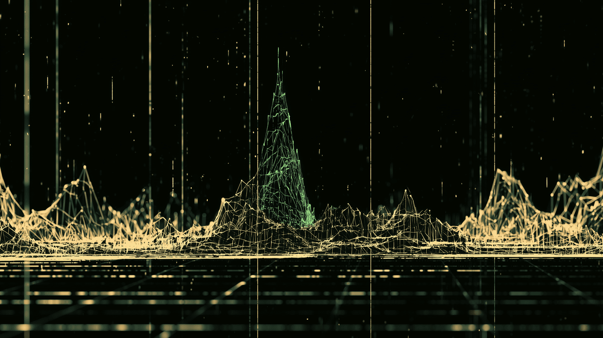

# assay

> Assay the weights before you trust them.



`assay` is an offline-first, single-binary scanner for ML model artifacts
(`safetensors`, GGUF, PyTorch pickle). It answers two questions about a model
you just downloaded:

1. **Is this file what it claims to be?** (provenance and integrity)
2. **Does loading it put my machine at risk?** (format-level safety)

A downloaded model is a multi-gigabyte opaque blob that people execute with
total trust. We would never do that with a random `.exe`. `assay` applies the
same supply-chain hygiene to model weights.

> The name comes from metallurgy: an *assay* tests the purity and composition of
> a metal. A model is literally *weights*, so `assay` tests whether those weights
> are pure (no contaminant) and authentic (real provenance).

`assay` never loads, imports, or executes a model. It reads bytes, and nothing
else. Files are memory-mapped and streamed, so peak RAM stays well under model
size even on a 70B baseline.

---

## Install

```sh
# from source
git clone https://github.com/Sn0wAlice/assay && cd assay
cargo install --path .

# from crates.io
cargo install assay
```

No runtime dependencies, no Python, no network access during a scan.

---

## Quick start

```sh
# scan a single file
assay scan model.safetensors

# scan a whole model directory (Hugging Face style repo)
assay scan ./Qwen2.5-0.5B-Instruct/

# verify a signature or provenance bundle alongside the weights
assay verify ./model/ --bundle model.sig --key signer.pub

# inspect the weights themselves, not just the container
assay scan ./model/ --deep --profile

# ask the sharpest question: how does this model differ from a known-good one?
assay compare ./model-suspect/ ./model-known-good/

# CI mode: machine-readable, non-zero exit on findings
assay scan ./model/ --json --fail-on high
```

[`TEST.md`](./TEST.md) walks you through all of this on real public models in
about two minutes. [`DUMMIE.md`](./DUMMIE.md) is the complete illustrated
walkthrough of every check, with ASCII diagrams and annotated output.

---

## What it checks

### Format detection

Every artifact is identified from its magic bytes, with the file extension used
only as a hint. `assay` refuses to guess when the bytes disagree with the name.
A repo that mixes `safetensors` and pickle is itself a signal, and it is
reported as one.

### Pickle and arbitrary code execution

`safetensors` exists precisely because Python pickle (`.bin`, `.pt`, `.ckpt`)
can run arbitrary code the moment you load it. `assay`:

- flags every pickle artifact as **untrusted by default**
- runs an opcode-level scan for dangerous patterns (`GLOBAL`, `REDUCE`,
  `STACK_GLOBAL`, imports of `os` / `subprocess` / `builtins`, and friends)
- looks inside torch zip containers rather than stopping at the archive
- tells you when a clean `safetensors` equivalent sits in the same repo

### safetensors structural validation

The format is safe by design, but the container still has attack surface
(overlapping offsets, malformed specs, denial of service at load time). `assay`:

- parses the `u64` length prefix and the JSON header
- validates every `data_offsets [begin, end]`: in bounds, `begin <= end`,
  non-overlapping, no range pointing outside the data segment
- rejects dtype and shape declarations that disagree with the byte ranges

### GGUF metadata sanity

GGUF carries no executable code, but its metadata can embed a Jinja2 chat
template, which is a code-ish injection surface. `assay`:

- validates magic, version, tensor count, and the KV metadata block
- checks that every tensor offset lands inside the file
- surfaces embedded chat templates for human review instead of silently
  trusting them

### Deterministic hashing

A per-tensor digest plus a manifest hash that is stable across
re-containerization: renaming the file or repacking the archive does not change
the model's identity, because the hash depends only on tensor identity and
tensor content. That manifest hash is what you pin in CI.

### Signature and provenance verification

Detached ed25519 signatures and model-transparency manifests are verified
against the computed hashes, and sidecar files next to the artifact are
auto-detected. A full Sigstore or cosign chain (Fulcio roots, Rekor
transparency log) is **not** implemented, so such bundles are reported as
present but unverified rather than treated as trusted. `signed` is only ever
printed on a real cryptographic pass.

### Weight inspection (`--deep`)

Everything above judges the container. `--deep` inspects the numbers inside it,
without ever loading the model:

- **per-tensor statistics** in a single streaming pass: NaN and Inf integrity,
  mean, std, L2 and RMS, excess kurtosis, sparsity, and 6 sigma outlier mass
- **per-layer profile** with robust median and MAD anomaly detection across
  layers, a terminal sparkline (`--profile`) and an honest 1D SVG chart
  (`--svg`)
- **secret and string scanning** over metadata, GGUF KV blocks, and sibling
  config and tokenizer files: API keys, PEM private key blocks, suspicious URLs
- **architectural fingerprint** derived from naming scheme, layer count, hidden
  dimension, head count, and vocabulary size, which catches a model that claims
  to be X but is structurally Y

### Differential comparison (`compare`)

Weight analysis is most honest as a diff against a known-good reference, not as
a judgment of a model in isolation. A normally trained transformer is naturally
non-uniform across layers, so a standalone profile will flag legitimate peaks.
`compare SUBJECT BASELINE` makes the baseline the zero line:

- identical models are silent (`IDENTICAL`)
- a uniform fine-tune shows broad, even drift and stays quiet
- a localized tamper shows a single concentrated spike and is flagged

It streams matched tensor pairs in lockstep (both files mapped, never both
models fully in RAM), canonicalizes naming differences such as a
`transformer.` wrapper prefix, recognizes weight tying instead of calling it a
divergence, guards against cross-architecture comparison (`ARCH_MISMATCH`,
override with `--force`), and reports added, removed, or reshaped tensors as
`STRUCTURAL_DIVERGENCE`.

---

## Verdicts and signals

`assay` is explicit about how much confidence a result carries, and the two
kinds of result are never mixed.

| | **Verdicts** | **Signals** |
|---|---|---|
| Produced by | container and provenance checks (always on) | `--deep` and `compare` |
| Based on | external ground truth ("pickle can execute code") | statistics, no ground truth |
| Output | `clean` / `untrusted` / malformed | scored findings with a severity |
| Means | this is what the file *is* | this is worth a human look |

A high score never means "malicious". It means anomalous. `assay` will always
tell you the confidence of a finding, and it never claims to catch what it
cannot.

---

## Command reference

### `assay scan PATH`

Scan a file or a model directory.

| Flag | Meaning |
|---|---|
| `--json` | machine-readable report on stdout |
| `--fail-on SEVERITY` | exit non-zero at or above this severity (default `high`) |
| `--color auto\|always\|never` | colorize output (default `auto`) |
| `--no-progress` | disable the real-time progress display on stderr |
| `--deep` (alias `--stats`) | inspect the weights, not just the container |
| `--profile` | print the per-layer sparkline (implies `--deep`) |
| `--svg FILE` | write the layer-profile chart as SVG (implies `--deep`) |
| `--mad-k K` | anomaly threshold in MADs from the cross-layer median (default `5.0`) |
| `--scan-tensor-entropy` | experimental: flag near-maximal-entropy integer tensor regions |

Progress prints to stderr and is disabled automatically off a TTY.

### `assay verify PATH`

Same checks as `scan`, focused on the provenance answer.

| Flag | Meaning |
|---|---|
| `--bundle FILE` | explicit signature or provenance bundle |
| `--key FILE` | ed25519 public key (raw or hex) for detached signatures |

Plus every flag from `scan`.

### `assay compare SUBJECT BASELINE`

Differential weight analysis against a known-good reference of the same
architecture.

| Flag | Meaning |
|---|---|
| `--json` | machine-readable drift report |
| `--svg FILE` | write the drift-per-layer chart as SVG |
| `--mad-k K` | concentration threshold for layer drift, in MADs (default `5.0`) |
| `--epsilon EPS` | elements differing by more than this count toward `changed_frac` (default `1e-6`) |
| `--force` | compare across mismatched architectures (output is unreliable) |
| `--fail-on SEVERITY` | exit non-zero at or above this severity (default `high`) |
| `--color auto\|always\|never` | colorize output (default `auto`) |

### Exit codes

| Code | Meaning |
|------|---------|
| `0`  | clean, nothing at or above the threshold |
| `1`  | findings at or above `--fail-on` severity |
| `2`  | unreadable or malformed artifact (parse failure) |
| `>2` | internal error |

---

## Example output

### `scan --deep --profile` on real gpt2

```text
$ assay scan ./models/gpt2 --deep --profile
[1/2] ./models/gpt2/model.safetensors CLEAN 3 finding(s) (22.90s)
[2/2] ./models/gpt2/pytorch_model.bin UNTRUSTED 3 finding(s) (1ms)
✓ scanned 2 artifact(s): 1 clean, 1 untrusted, 1.0 GiB in 22.91s

./models/gpt2/model.safetensors  [safetensors]  -> CLEAN
  manifest: blake3:d4ceed607f7040ba84b91eadef010d98079f9d9d85ffd6faf13d77ce958eccdf
  signature: unsigned
  [low] WEIGHT_OUTLIER_LAYER: layer 3 is anomalous on mean_kurtosis (6.0 MADs from the cross-layer median); worth a human look, not a verdict
      - metric=mean_kurtosis, value=119.9821, mads=6.00
  [low] WEIGHT_OUTLIER_LAYER: layer 11 is anomalous on l2 (7.3 MADs from the cross-layer median); worth a human look, not a verdict
      - metric=l2, value=840.6817, mads=7.27
  [info] ARCH_DETECTED: structural fingerprint: gpt2 (gpt2)
      - layers=Some(12), hidden=Some(768), heads=Some(12), vocab=Some(50257)

./models/gpt2/pytorch_model.bin  [pickle]  -> UNTRUSTED
  signature: unsigned
  [high] PICKLE_RCE_RISK: pickle artifact can execute code at load time
      - execution opcodes: REDUCE, BUILD
  [medium] PICKLE_TRUNCATED: pickle opcode stream ended unexpectedly or hit an unknown opcode; analysis may be incomplete
  [info] SAFE_ALTERNATIVE_AVAILABLE: a safetensors artifact is present in the same repo; prefer it

scanned 2 artifact(s); worst finding: high

./models/gpt2/model.safetensors
layer profile ▅▁▂▁▂▁▂▂▃▄▆█ (12 layers, metric=l2)
  min=787.0994  max=840.6817
  anomalous layers: 3, 11
```

> The pickle line is the whole pitch: you were one `torch.load` away from
> running someone else's code, with a clean `safetensors` file sitting right
> next to it.
>
> Note layers **3 and 11** flagged on the clean file. On a model *in isolation*
> you cannot tell a legitimate peak from an injected one, because a well-trained
> transformer is naturally non-uniform. That is exactly why `compare` exists.

### `compare` against a real fine-tune (DialoGPT): broad drift, no false alarm

```text
$ assay compare ./models/gpt2 ./models/dialogpt
compare ./models/gpt2/model.safetensors vs ./models/dialogpt/model.safetensors
  arch: gpt2 vs gpt2 (match)
  normalized: stripped wrapper prefix from 160 baseline tensor name(s)
  160 matched, 0 structural divergence(s), worst rel_l2: 1.4601
  drift profile ▂▁▃▂▂▄▅▆█▇▇█ (12 layers, metric=rel_l2)
    min=0.1385  max=0.2105
    no anomalous layers
  [info] TIED_WEIGHT: 'lm_head.weight' is tied to 'transformer.wte.weight'; weight tying is a serialization convention, not a divergence
      - counterpart present on same side with equal values
```

> DialoGPT is a full fine-tune of gpt2: every layer moved a little, drift is
> broad and homogeneous, so **nothing is flagged**. The `transformer.` naming
> prefix is canonicalized away (160 matched, **0** structural divergences), and
> the tied `lm_head` / `wte` pair is reported as info.

### `compare` against a tampered copy: the spike lights up

```text
$ python make_tampered_gpt2.py ./models/gpt2/model.safetensors \
        ./models/gpt2-tampered/model.safetensors --layer 5 --scale 4.0
$ assay compare ./models/gpt2 ./models/gpt2-tampered
compare ./models/gpt2/model.safetensors vs ./models/gpt2-tampered/model.safetensors
  arch: gpt2 vs gpt2 (match)
  160 matched, 0 structural divergence(s), worst rel_l2: 0.7500
  drift profile ▁▁▁▁▁█▁▁▁▁▁▁ (12 layers, metric=rel_l2)
    min=0.0000  max=0.5359
    anomalous layers: 5
  [medium] LAYER_DRIFT_OUTLIER: layer 5 drift is a concentrated outlier (rel_l2=0.536, 12.0 MADs above the cross-layer drift level); worth a human look, not a verdict
      - dominant tensor: h.5.mlp.c_fc.weight
  [medium] TENSOR_DRIFT: tensor 'h.5.mlp.c_fc.weight' dominates the drift of layer 5
```

> Only the tampered layer 5 spikes. Layers 3 and 11, the ones the standalone
> profile flagged above, stay **silent** here, because they do not move versus
> the baseline. That is the payoff of differential analysis.

See [`DUMMIE.md`](./DUMMIE.md) for a line-by-line explanation of every field in
this output.

---

## JSON output

`--json` prints one report per artifact. A single-file scan prints the report
object directly; a directory scan wraps them in `{ "artifacts": [ ... ] }`:

```json
{
  "artifact": "./models/gpt2/pytorch_model.bin",
  "format": "pickle",
  "verdict": "untrusted",
  "findings": [
    {
      "id": "PICKLE_RCE_RISK",
      "severity": "high",
      "detail": "pickle artifact can execute code at load time",
      "evidence": ["execution opcodes: REDUCE, BUILD"]
    },
    {
      "id": "PICKLE_TRUNCATED",
      "severity": "medium",
      "detail": "pickle opcode stream ended unexpectedly or hit an unknown opcode; analysis may be incomplete"
    }
  ],
  "signature": "unsigned"
}
```

For `safetensors` and GGUF the report also carries `hashes` (`manifest` plus
`per_tensor`), and with `--deep` it gains `stats`, `layer_profile`, and
`fingerprint`. A `compare --json` report carries `subject`, `baseline`, `arch`,
`structural_divergences`, `tensor_drift`, `layer_drift`, `findings`, and
`summary`.

---

## In CI

```sh
# fail the pipeline if any artifact is untrusted, and keep the report
assay scan ./models/ --json --fail-on high | tee assay-report.json
```

```yaml
- name: Assay model artifacts
  run: |
    cargo install assay
    assay scan ./models/ --json --fail-on high | tee assay-report.json
```

Pin the manifest hash from a known-good run and compare it on every build: a
changed manifest means the weights changed, whatever the filename says.

---

## Findings reference

**Container and provenance (verdict grade)**

| ID | Severity |
|---|---|
| `PICKLE_RCE_RISK` | high |
| `PICKLE_GLOBAL_REF`, `PICKLE_UNTRUSTED`, `PICKLE_TRUNCATED` | medium |
| `PICKLE_CONTAINER_NO_PICKLE`, `PICKLE_CONTAINER_UNREADABLE` | medium |
| `ST_OFFSET_OOB`, `ST_OFFSET_OVERLAP` | high |
| `ST_HEADER_MALFORMED`, `ST_DTYPE_SHAPE_MISMATCH` | medium |
| `ST_DTYPE_UNKNOWN` | low |
| `GGUF_PARSE_ERROR`, `GGUF_BAD_VERSION`, `GGUF_OFFSET_OOB` | high |
| `GGUF_CHAT_TEMPLATE` | low |
| `SIG_MISMATCH` | high |
| `SIG_NO_MANIFEST`, `SIG_KEY_UNREADABLE`, `SIG_BUNDLE_UNREADABLE`, `SIG_UNRECOGNIZED`, `SIG_ERROR` | low |
| `SIG_VERIFIED`, `SIG_MANIFEST_MATCH`, `SIG_NO_KEY`, `SIG_SIGSTORE_UNVERIFIED` | info |
| `IO_ERROR` | high |
| `UNKNOWN_FORMAT` | medium |
| `SAFE_ALTERNATIVE_AVAILABLE`, `NO_ARTIFACTS` | info |

**Weight signals (`--deep`)**

| ID | Severity |
|---|---|
| `WEIGHT_NAN_INF` | high |
| `EMBEDDED_SECRET` | high, medium, or low by confidence |
| `ARCH_MISMATCH` | medium |
| `WEIGHT_OUTLIER_LAYER` | low or medium by deviation |
| `ARCH_DETECTED`, `SUSPICIOUS_URL`, `STATS_DEFERRED_QUANTIZED`, `TENSOR_ENTROPY_ANOMALY` | info |

**Drift signals (`compare`)**

| ID | Severity |
|---|---|
| `STRUCTURAL_DIVERGENCE`, `COMPARE_ERROR` | high |
| `ARCH_MISMATCH` | high, or medium with `--force` |
| `LAYER_DRIFT_OUTLIER`, `TENSOR_DRIFT` | low, medium, or high by drift magnitude |
| `IDENTICAL`, `TIED_WEIGHT`, `DRIFT_DEFERRED_QUANTIZED` | info |

---

## Design principles

- **Offline first.** No network calls during a scan. Signature roots are bundled
  or supplied explicitly.
- **Never load the model.** No framework, no import, no forward pass. Bytes only.
- **Single binary, no runtime deps.** Drop it into a CI image or an air-gapped
  box and run it.
- **Honest confidence.** Every finding carries a severity, and a statistical
  signal is never dressed up as a verdict.
- **Deterministic.** The same bytes always produce the same manifest hash and
  the same verdicts.
- **Dogfoodable.** Built to be run on real artifacts pulled off public hubs.

---

## Limits

Worth knowing before you rely on it:

- **Quantized GGUF is partially covered.** Legacy quants (Q4_0, Q4_1, Q5_0,
  Q5_1, Q8_0) and F32, F16, BF16 are dequantized for real statistics. K-quant
  and IQ tensors are reported as `STATS_DEFERRED_QUANTIZED` (structural
  information only) rather than computing garbage on raw block bytes. Full
  k-quant decoding is the next milestone.
- **Quantization-triggered payloads are not detected yet.** A payload that only
  activates after GGUF quantization needs a full-precision reference and a
  per-weight quantization-error diff. The dequantization, streaming, and
  lockstep drift machinery is in place; the check itself is not shipped and is
  deliberately not promised.
- **Sigstore and cosign chains are not verified.** They are reported as
  unverified, never as trusted.
- **Behavioral fingerprinting is permanently out of scope.** Gradient or
  forward-pass identification would require executing the model, which breaks
  the invariant this tool is built on.
- **Weight analysis finds anomalies, not intent.** A signal is a reason to look,
  never a proof of malice.

---

## Learn more

- [`DUMMIE.md`](./DUMMIE.md): the complete illustrated walkthrough, with ASCII
  diagrams of every check and annotated real output.
- [`TEST.md`](./TEST.md): download real public models and try `assay` in two
  minutes, including a harmless self-test that proves the pickle scanner fires.

Found a model `assay` should have flagged and did not? That is the best possible
bug report. Open an issue with the repo id.

## License

Apache-2.0.
